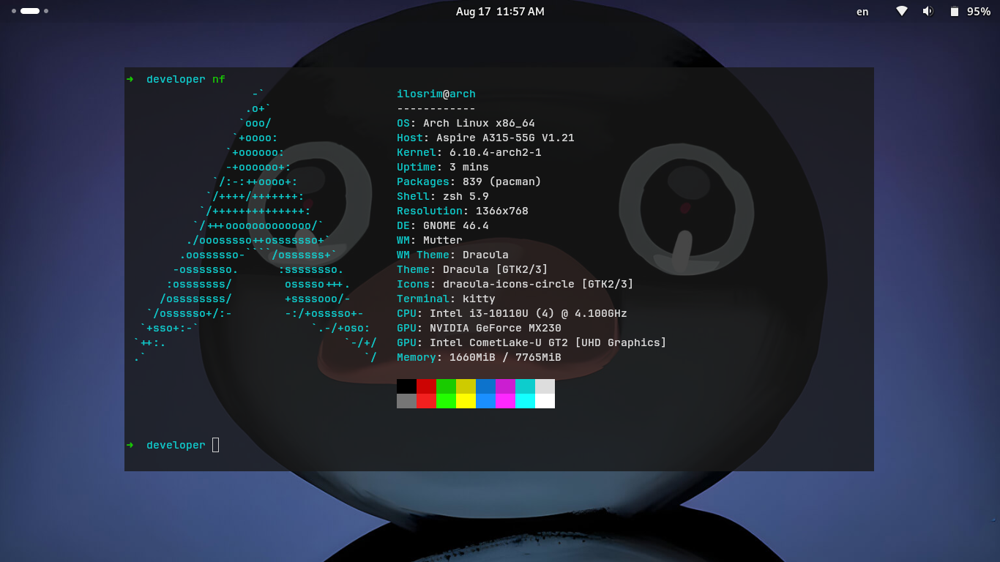
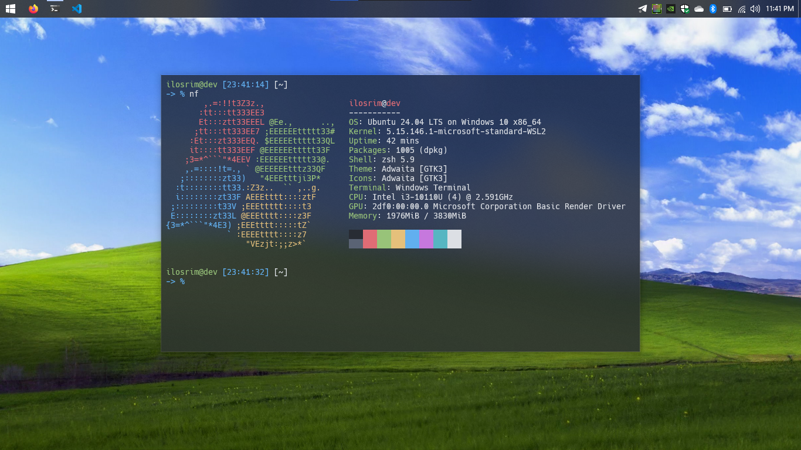
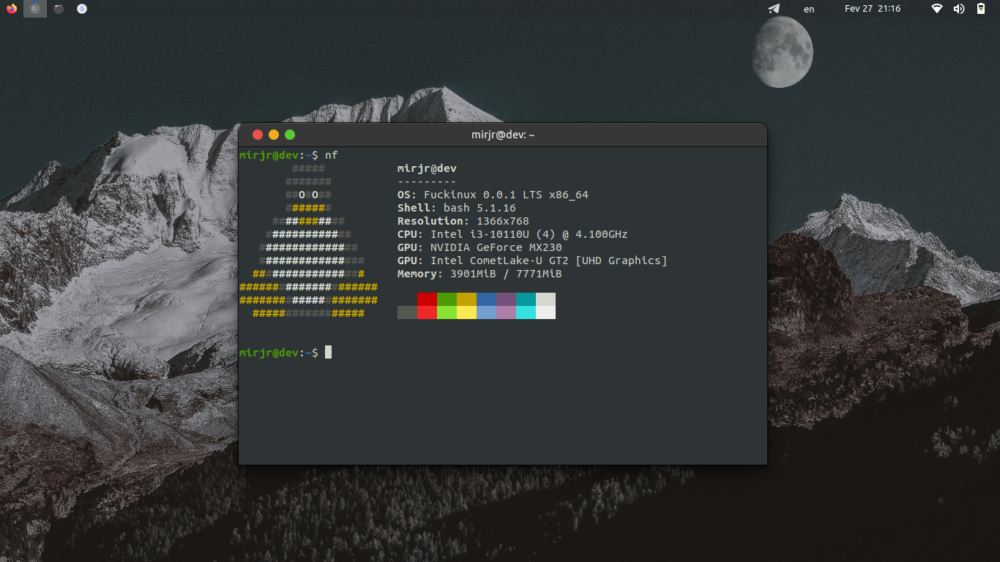
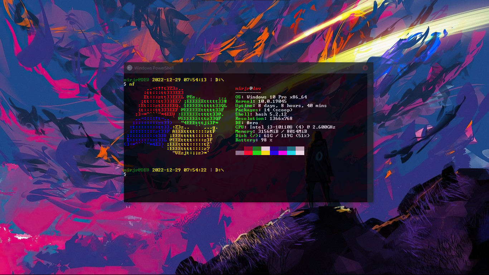
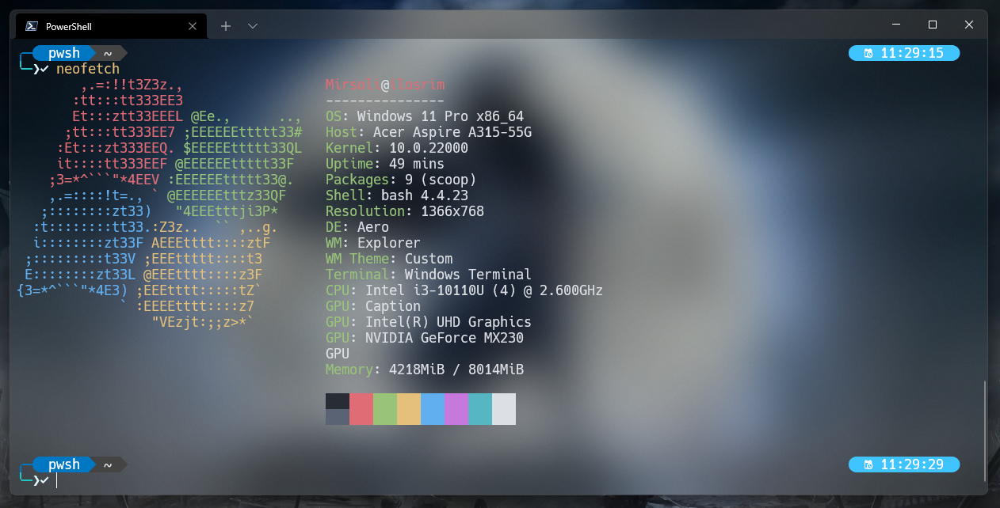
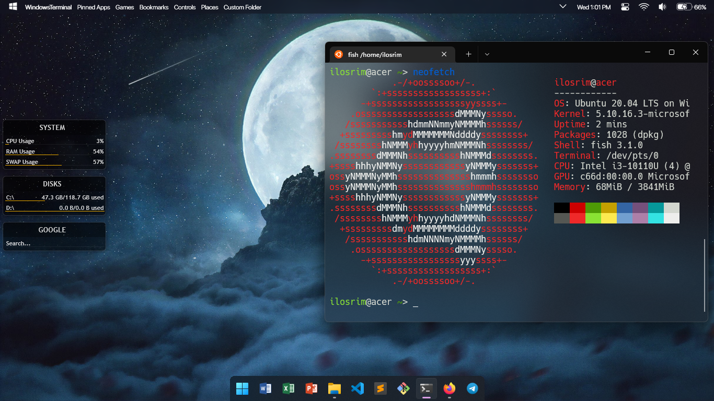

# ilosrim's configs

<!-- 
This repository, `ilosrim/my-configs`, is a curated collection of configuration files and scripts that streamline the development environment setup. It serves as a personal toolkit to maintain consistency across various systems and projects.

## Features

- **Dotfiles:** Easy-to-use configuration files for bash, git, and more.
- **Scripts:** Handy scripts to automate routine tasks.
- **Customization:** Options to personalize your development workspace.
- **Portability:** Quickly set up your preferred environment on any new machine.

## Usage

Clone the repository to your local machine and follow the instructions in the README to apply the configurations to your system.

## Contributions

Suggestions and contributions are welcome! If you have improvements or additional configurations that could benefit others, please submit a pull request.

Discover the power of a personalized, efficient development environment with ilosrim's Configs.

<h3 align="center"><b>Examples</b></h3>
-->

- **Operatsion Tizim:** Arch Linux x86_64
- **Terminal:** kitty
- **Shell:** zsh 5.9

- **Operatsion Tizim:** Ubuntu 24.04 LTS on Windows 10 x86_64
- **Terminal:** Windows Terminal
- **Shell:** zsh 5.9

- **Operatsion Tizim:** Fuckinux 0.0.1 LTS x86_64
- **Terminal:** Gnome Terminal
- **Shell:** Bash 5.1.16

- **Operatsion Tizim:** Windows 10 Pro x86_64
- **Terminal:** PowerShell Terminal
- **Shrift:** Raster Fonts

- **Operatsion Tizim:** Windows 11 Pro x86_64
- **Terminal:** Windows Terminal
- **Shrift:** Hack Regular Nerd Font Complete Mono Windows Compatible
- **Ranglar Sxemasi:** [`Powerline`](https://github.com/b-ryan/powerline-shell)

- **Operatsion Tizim:** Arch Linux on Windows 10 Pro x86_64
- **Terminal:** Fish
- **Shrift:** Hack Regular Nerd Font

- **Operatsion Tizim:** Ubuntu on Windows 10 Pro x86_64
- **Terminal:** Fish
- **Shrift:** Hack Regular Nerd Font

