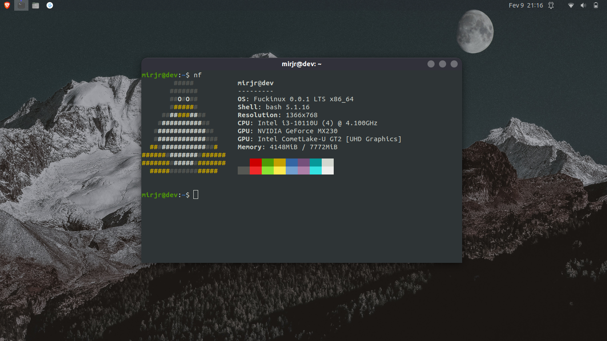
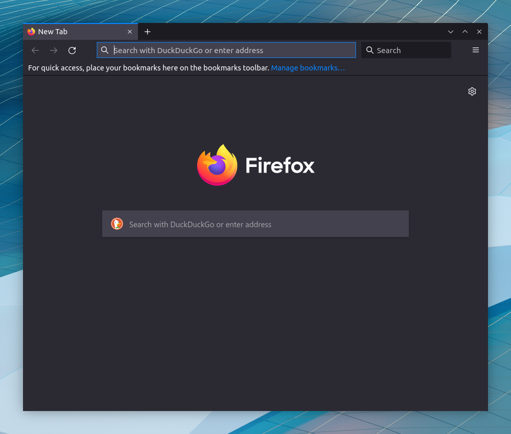

<h3 align="center"><b>My configs</b></h3>

- **Operatsion Tizim:** Fuckinux 0.0.1 LTS x86_64
- **Terminal:** Gnome Terminal
- **Shell:** Bash 5.1.16

- **Operatsion Tizim:** Windows 10 Pro x86_64
- **Terminal:** PowerShell Terminal
- **Shrift:** Raster Fonts

- **Operatsion Tizim:** Windows 11 Pro x86_64
- **Terminal:** Windows Terminal
- **Shrift:** Hack Regular Nerd Font Complete Mono Windows Compatible
- **Ranglar Sxemasi:** [`Powerline`](https://github.com/b-ryan/powerline-shell)

- **Operatsion Tizim:** Arch Linux on Windows 10 Pro x86_64
- **Terminal:** Fish
- **Shrift:** Hack Regular Nerd Font

- **Operatsion Tizim:** Ubuntu on Windows 10 Pro x86_64
- **Terminal:** Fish
- **Shrift:** Hack Regular Nerd Font

- **Operatsion Tizim:** Parqinsa
